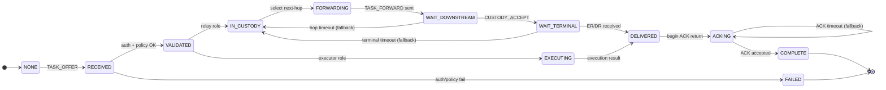

```mermaid
stateDiagram-v2
    direction LR

    [*] --> NONE
    NONE --> RECEIVED: TASK_OFFER
    RECEIVED --> VALIDATED: auth + policy OK
    RECEIVED --> FAILED: auth/policy fail
    VALIDATED --> EXECUTING: executor role
    VALIDATED --> IN_CUSTODY: relay role
    IN_CUSTODY --> FORWARDING: select next-hop
    FORWARDING --> WAIT_DOWNSTREAM: TASK_FORWARD sent
    WAIT_DOWNSTREAM --> IN_CUSTODY: hop timeout (fallback)
    WAIT_DOWNSTREAM --> WAIT_TERMINAL: CUSTODY_ACCEPT
    WAIT_TERMINAL --> DELIVERED: ER/DR received
    WAIT_TERMINAL --> IN_CUSTODY: terminal timeout (fallback)
    EXECUTING --> DELIVERED: execution result
    DELIVERED --> ACKING: begin ACK return
    ACKING --> ACKING: ACK timeout (fallback)
    ACKING --> COMPLETE: ACK accepted
    COMPLETE --> [*]
    FAILED --> [*]
```
